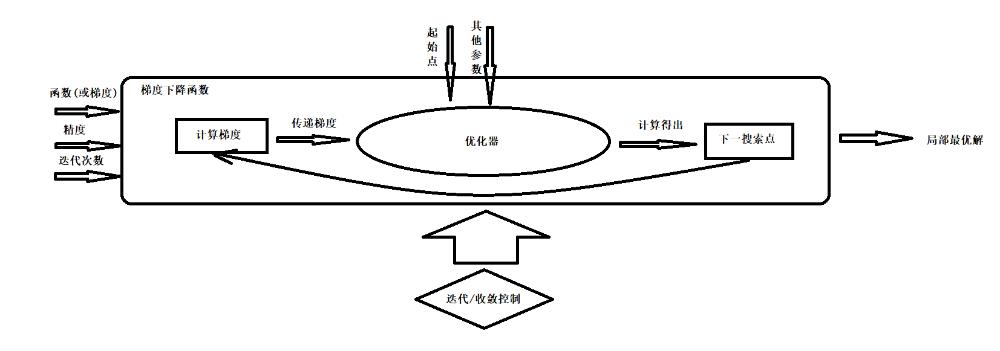
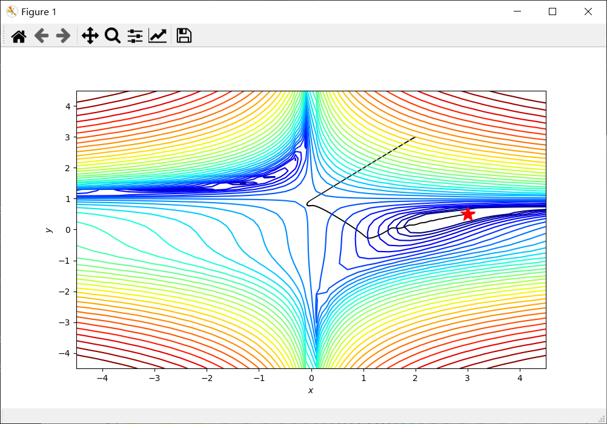
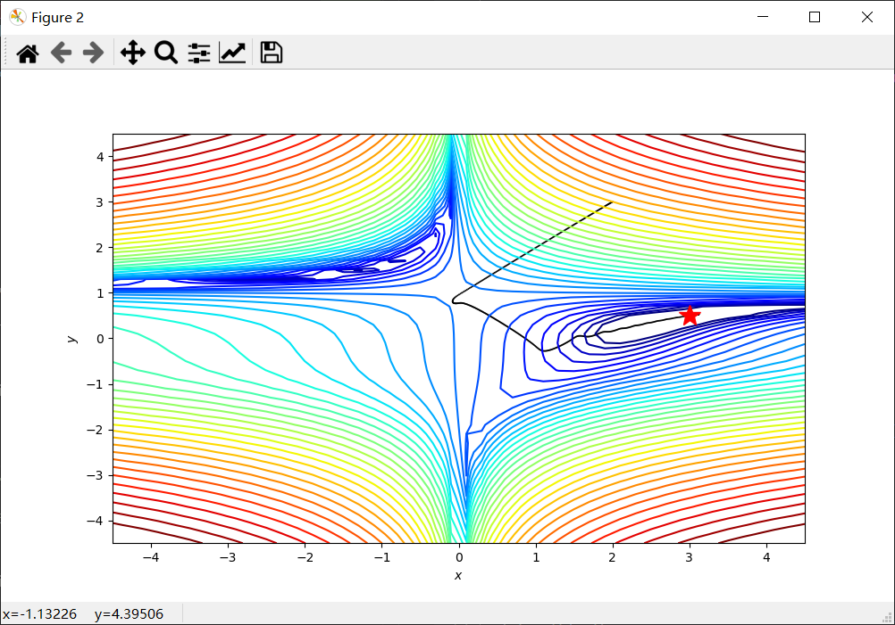

[TOC]

------

# 梯度下降法

神经网络中经常使用到的优化算法是梯度下降法,梯度下降法作为优化方法的一种,是基于梯度的优化算法,具有非全局的(不代表无法求得全局最值),计算简单,收敛较快等优点.

事实上,优化方法有很多.例如群智能算法(如遗传算法,粒子群算法等),模拟退火算法,牛顿法,拟牛顿法等.这些算法理论上均可以作为神经网络的优化器,但是由于神经网络的规模,计算资源以及计算难度等限制,实际使用中不会使用这些优化算法作为神经网络优化器的算法.

## 梯度下降法思想

对于一个一元函数$f(x)$,如果在点x附近有微小变化$\Delta x$,则$f(x)$的变化为$f(x+\Delta x)$可以表示为如下的微分形式.

$$
f(x+\Delta x) - f(x) \approx f'(x)\Delta x \tag{1.1}
$$

如果取$\Delta x = - \alpha f'(x)$($\alpha$为一个很小的正数),那么$f(x+\Delta x) - f(x) = -\alpha f'(x)^2$是负数,即$f(x+\Delta x)$比$f(x)$小.可以理解为$x$沿着$f'(x)$的反方向运动$\Delta x$距离,函数值有所下降.

因此,只要不断重复这个过程,就能使$f(x)$不断接近最小值,最终,$f'(x)$将趋近为0,$x$每次移动的距离也会趋近于0,收敛在最小值点的位置.

> 注意: $\alpha$应该是一个适当小的正数,如果数值过大,每次移动的步长将会很大,从而导致$x$不断震荡;相反,如果数值过小,每次优化几乎不会移动,收敛速度将会非常慢.

由于梯度下降法通过迭代来逼近最优解,为了使算法能够停止,可以用如下方法作为停止的标志:

- $f'(x)$的绝对值足够小
- 迭代次数达到预先设定的最大迭代次数

`FastModel.GD`是`FastModel`中的梯度下降库,内部包含了梯度下降参数优化器以及梯度下降函数.下面给出了梯度下降函数`FastModel.GD.gradient_descent`.

**gradient_descent** : (分析)梯度下降函数

```py
gradient_descent(df,optimizer,iterations,epsilon=1e-8): 

    · df : function,原函数关于优化参数的导函数,接收参数后返回np.array,形状(n,),
            其中n为参数个数
    · optimizer : Optimizer,梯度下降优化器
    · iterations : int,迭代次数
    · epsilon : float,可选
        误差 默认为1e-8

    --返回--
    参数优化历史列表
```

有了梯度下降函数,我们便可以通过传入优化器,实现完整的梯度下降优化.

<center>

</center>

## 经典梯度下降法

最基本的梯度下降法基于梯度下降思想立即得出的优化方法.更新方法如下:

$$
x \leftarrow x - \alpha \nabla f(x) \tag{2.1}
$$

其中$\alpha$为学习率,是一个较小的正数.

### 优化器和GD优化器

`FastModel.GD`中包含了许多常见的梯度下降优化器,这些优化器都继承自一个抽象类`FastModel.GD.Optimizer`.

**Optimizer** : 优化器类

```py
● __init__(self): 初始化

    · params : 优化参数

● step(self,grads): 更新

    · grads : 梯度

● parameters(self): 获得参数

```

经典梯度下降参数优化器为`FastModel.GD.GD`.

**GD** : 经典梯度下降优化器

```py
● __init__(self,params,learning_rate):

    · params : 优化参数初始值
    · learning_rate : 学习率

● step(self,grads):

    · grads : numpy.array
            梯度，数组形状为(n,),
            其中n为参数个数


    --返回--
    numpy.array,返回优化后的参数
```

## Momentum-梯度下降法

Momentum-梯度下降法又称"动量法".在经典的梯度下降法,学习率是一个固定的值,但在迭代过程中,梯度大小是不断变化的,这可能导致学习率在某些情况下并不"恰当",前面我们也讨论了学习率设置不当的后果——参数震荡(学习率过大)或收敛过慢(学习率过小).因此,一个随着梯度不断调整的学习率更符合梯度下降的要求,"动量法"就是之一.

"动量法"在更新x的向量时,不仅会考虑当前梯度,还会考虑上次更新的向量,即认为更新的向量具有惯性.

我们用$v_t$表示当前更新周期的惯性(类似速度),则"动量法"的更新公式为:

$$
x \leftarrow x - v_t \tag{3.1}
$$

其中$v_t$的更新公式为:

$$
v_t = \gamma v_{t-1} + \alpha \nabla f(x) \tag{3.2}
$$

其中$\alpha$为学习率,$\gamma$为惯性参数.

"动量法"将需要更新的向量视为一个运动物体的速度,而速度时有惯性的,由于结合了之前的更新向量和当前的梯度,"动量法"缓解了不同时刻梯度的剧烈变化,既保持着之前运动的惯性,使其在梯度很小的地方仍然具有较大的运动速度,也不会因为梯度突增而发生过冲.

### GD_Momentum 优化器

```py
● __init__(self,params,learning_rate,gamma):

    · params : numpy.array
            梯度下降擦书数字,数组形状为(n,),
            其中n为参数个数
    · learning_rate : float,学习率
    · gamma : float,惯性参数    

● step(self,grads): 梯度下降

    · grads : numpy.array 
        梯度,数组形状为(n,)
        其中n为参数个数

    --返回--
    优化后的参数
```

## AdaGrad-梯度下降法

在多变量函数中,每个变量的偏导数可能相差很大,如果使用同一个学习率,可能出现适合一个分量但不适合另一个分量的情况,从而造成震荡或者停滞.

AdaGrad法对每个梯度分量除以历史累加值,从而消除不同分量梯度大小不均衡的问题.

我们考虑两个分量$(x,y)$,分别计算各自的历史累加值$(G1,G2)$,计算方法如下:
$$
    G_{t,i} = \sqrt{\sum_{t'=1}^{t} g^2_{t',i}} \tag{4.1}
$$
其中$g_{t,i} = \nabla_{\theta} f(x_{t,i})$表示第t轮迭代中分量$i$的偏导数.

得到历史累加值后,两个分量分别按照如下方式进行更新:
$$
    x \leftarrow x - \alpha \frac{1}{G_1}\frac{\partial f}{\partial x} \\
    y \leftarrow y - \alpha \frac{1}{G_2}\frac{\partial f}{\partial y} \tag{4.2}
$$
通过对每个分量分别处理,消除了分量梯度大小不均衡的问题.

AdaGrad有一个致命缺点,就是累加会使得$G$变得越来越大,最终导致学习变得缓慢甚至停滞.

### GD_AdaGrad 优化器

```py
● __init__(self,params,learning_rate,epsilon) : 初始化  

    · params : numpy.array
            梯度下降参数数组，数组形状(n,),
            其中n为参数个数
    · learning_rate : float,学习率
    · epsilon : 内部调节参数,默认1e-8

● step(self,grads): 梯度下降

    · grads : numpy.array 
        梯度,数组形状为(n,)
        其中n为参数个数

    --返回--
    优化后的参数
```

## AdaDelta-梯度下降法

为了解决AdaGrad法的收敛停滞问题,可以考虑用均方和代替$G$.

$$
E[g^2]_t = \frac{G_t}{t} \tag{5.1}
$$

$E[g^2]_t$可以通过移动平均法计算得出:
$$
E[\Delta x^2]_t = \gamma E[g^2]_{t-1} + (1 - \gamma) \Delta g_t^2 \tag{5.2}
$$
AdaDelta 法更进一步,对更新向量采用移动平均值,使更新变得更加平滑:
$$
E[\Delta x^2]_t = \gamma E[\Delta x^2]_{t-1} + (1-\gamma)\Delta x_t^2 \tag{5.3}
$$
$(5.2),(5.3)$中的$\gamma$是同一个参数,称为衰减率.

最终,更新向量如下:
$$
\Delta x_t = - \sqrt{\frac{E[\Delta x^2]_{t-1}+\epsilon}{E[g^2]_t+\epsilon}}g_t \tag{5.4}
$$
参数更新公式为:
$$
x_{t+1} = x_t + \alpha \Delta x_t \tag{5.5}
$$

### GD_AdaDelta 优化器

```py
● __init__(self,params,learning_rate,rho):

    · params : numpy.array
            梯度下降参数数组,数组形状为(n,),
            其中n为参数个数
    · learning_rate : float,学习率
    · rho : float,衰减参数   

● step(self,grads): 梯度下降

    · grads : numpy.array 
        梯度,数组形状为(n,)
        其中n为参数个数

    --返回--
    优化后的参数
```

## RMSprop-梯度下降法

RMSprop 法的思想是,将梯度的所有数值都除以一个长度,即转换为单位长度,从而可以总以固定的步长$\alpha$来更新参数$x$.为了聚散梯度的每个分量的长度,RMSprop法采用类似Momentum法的方式——计算梯度值的平均移动长度的平方.
$$
    v_t = \beta v_{t-1} + (1 - \beta) \nabla f(x)^2 \tag{6.1}
$$
其中$\beta$为衰减参数.

更新方式:
$$
x \leftarrow x - \alpha \frac{1}{\sqrt{v_t} + \epsilon} \nabla f(x) \tag{6.2}
$$

### GD_RMSprop 优化器

```py
● __init__(self,params,learning_rate,beta,epsilon):

    · params : numpy.array
            梯度下降擦书数字,数组形状为(n,),
            其中n为参数个数
    · learning_rate : float,学习率
    · beta : float,衰减参数    
    · epsilon : 内部调节参数,默认1e-8

● step(self,grads): 梯度下降

    · grads : numpy.array 
        梯度,数组形状为(n,)
        其中n为参数个数

    --返回--
    优化后的参数
```

## Adam-梯度下降法

Adam法是最流行的梯度下降法之一,它既存储了梯度的累积值,又存储了梯度平方累积平均值.分别用$m_t,v_t$表示过去的梯度和梯度平方的移动平均值.公式如下.
$$
m_t = \beta_1 m_{t-1} + (1 - \beta_1) g_t  \tag{7.1}
$$

$$
v_t = \beta_2 v_{t-1} + (1 - \beta_2) g_t^2 \tag{7.2}
$$

Adam更新公式如下:
$$
x_{t+1} \leftarrow x_{t} - \frac{\alpha}{\sqrt{v_t+\epsilon}}\hat{m_t} \tag{7.3}
$$
对于衰减率很小时($\beta_1,\beta_2接近1$),$m_t,v_t$将接近0,尤其是迭代初期.因此可以做如下更正:
$$
    \hat{m_t} = \frac{m_t}{1 - \beta_1^t} \tag{7.4}
$$

$$
\hat{v_t} = \frac{v_t}{1-\beta_2^t} \tag{7.5}
$$

新的更新公式为:

$$
x_{t+1} \leftarrow x_{t} - \frac{\alpha}{\sqrt{\hat{v_t}+\epsilon}}\hat{m_t} \tag{7.3}
$$

### GD_Adam 优化器

```py
● __init__(self,params,learning_rate,beta1,beta2,epsilon):

    · params : numpy.array
            梯度下降参数数组,数组形状为(n,),
            其中n为参数个数
    · learning_rate : float,学习率
    · beta1 : float,衰减参数1(惯性参数)
    · beta2 : float,衰减参数2(摩擦力参数)    
    · epsilon : 内部调节参数,默认1e-8

● step(self,grads): 梯度下降

    · grads : numpy.array 
        梯度,数组形状为(n,)
        其中n为参数个数

    --返回--
    优化后的参数
```

## 数值梯度下降

前面介绍的梯度下降法是基于分析梯度的,即给出了下降函数的梯度表达式,从而求出相应的梯度.数值梯度则通过原函数在搜索点处的平均梯度代替搜索点处的梯度.

以二元函数$f(x,y)$为例,则二元函数的数值梯度可以写成:
$$
	\frac{\partial f}{\partial x} \approx \frac{f(x+\epsilon)-f(x-\epsilon)}{2\epsilon} \\
	\frac{\partial f}{\partial y} \approx \frac{f(y+\epsilon)-f(y-\epsilon)}{2\epsilon} \tag{8.1}
$$

$$
\nabla f(x,y) =\bigg \{\frac{\partial f}{\partial x},\frac{\partial f}{\partial y}\bigg \} \tag{8.2}
$$

其中$\epsilon$是一个很小的正数,被称为误差,理论上只要误差足够小,那么数值上平均梯度就可以逼近梯度.

数值梯度下降适合小规模或者不方便求解分析梯度的问题,对于大规模的求解问题数值梯度方法的速度要远远慢于分析梯度.

`FastModel.GD`中基于数值梯度下降的函数是`FastModel.GD.numerical_gradient_descent`.

**numerical_gradient_descent** : (数值)梯度下降函数

```py
numerical_gradient_descent(f,optimizer,iterations,epsilon=1e-8): 

    · f : function,原函数
    · optimizer : Optimizer,梯度下降优化器
    · iterations : int,迭代次数
    · epsilon : float,可选
        误差 默认为1e-8
```


## 示例代码

```py
from FastModel.GD import *
import numpy as np
import matplotlib.pyplot as plt
from matplotlib.color import LogNorm
# =============================================================================
# 梯度下降测试
# =============================================================================
# 原函数
f  = lambda x, y: (1.5 - x + x*y)**2 + (2.25 - x + x*y**2)**2 + (2.625 - x + x*y**3)**2
# 导函数
df = lambda x: np.array( [2*(1.5 - x[0] + x[0]*x[1])*(x[1]-1) + 2*(2.25 - x[0] + x[0]*x[1]**2)*(x[1]**2-1)
                                        + 2*(2.625 - x[0] + x[0]*x[1]**3)*(x[1]**3-1),
                           2*(1.5 - x[0] + x[0]*x[1])*x[0] + 2*(2.25 - x[0] + x[0]*x[1]**2)*(2*x[0]*x[1]) 
                                         + 2*(2.625 - x[0] + x[0]*x[1]**3)*(3*x[0]*x[1]**2)]) 
# 规范后的原函数
func = lambda a : f(a[0],a[1])
# 起点,边界设置,网格点
minima = np.array([3., .5])
minima_ = minima.reshape(-1, 1)

xmin, xmax, xstep = -4.5, 4.5, .2
ymin, ymax, ystep = -4.5, 4.5, .2
x_list = np.arange(xmin, xmax + xstep, xstep)
y_list = np.arange(ymin, ymax + ystep, ystep)
x, y = np.meshgrid(x_list, y_list)
z = f(x, y)
# 可视化函数
def plot_path(path,x,y,z,minima_,xmin, xmax,ymin, ymax):
    fig, ax = plt.subplots(figsize=(10, 6))
    ax.contour(x, y, z, levels=np.logspace(0, 5, 35), norm=LogNorm(), cmap=plt.cm.jet)
    
    ax.quiver(path[:-1,0], path[:-1,1], path[1:,0]-path[:-1,0], path[1:,1]-path[:-1,1], scale_units='xy', angles='xy', scale=1, color='k')
    ax.plot(*minima_, 'r*', markersize=18)

    ax.set_xlabel('$x$')
    ax.set_ylabel('$y$')    
    ax.set_xlim((xmin, xmax))
    ax.set_ylim((ymin, ymax))
    plt.show()

## (1) 使用数值梯度计算
# 定义Adam优化器 (起始点,学习率,beta1,beta2)
opt = GD_Adam(np.array([2.,3.]),0.01,0.9,0.8)
# 数值梯度
path = numerical_gradient_descent(func,opt,500)
# 可视化结果
path = np.asarray(path)
plot_path(path,x,y,z,minima_,xmin,xmax,ymin,ymax)

## (2) 使用分析梯度计算
# 定义Adam优化器 (起始点,学习率,beta1,beta2)
opt = GD_Adam(np.array([2.,3.]),0.01,0.9,0.8)
# 分析梯度
path = gradient_descent(df,opt,500)
path = np.asarray(path)
# 可视化结果
plot_path(path,x,y,z,minima_,xmin,xmax,ymin,ymax)
```

可视化结果如下:

<center>
 

</center>

