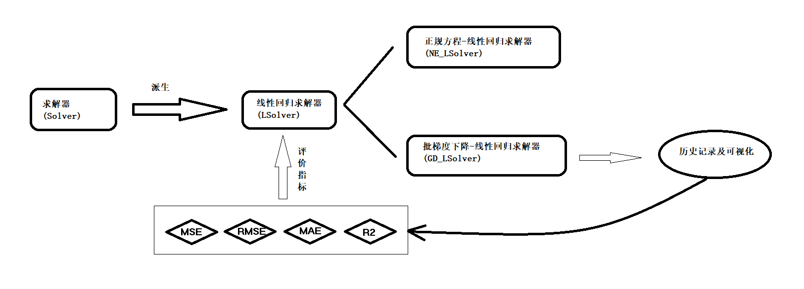
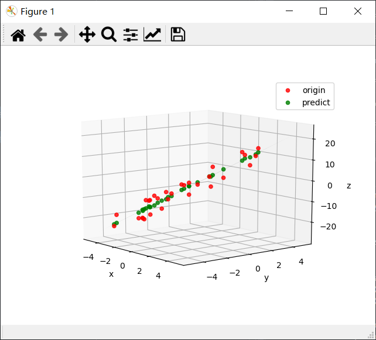
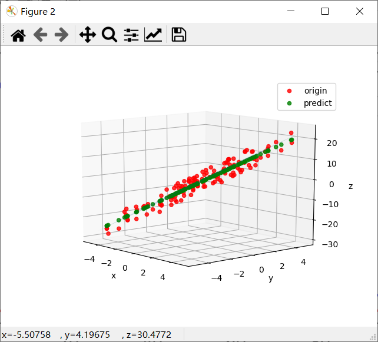
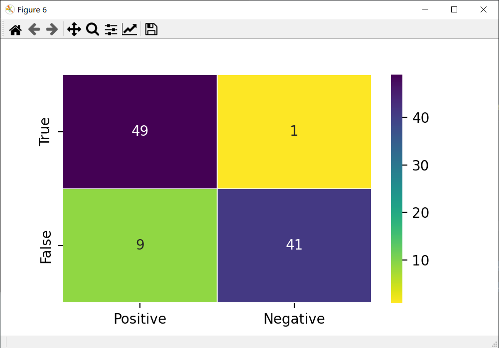
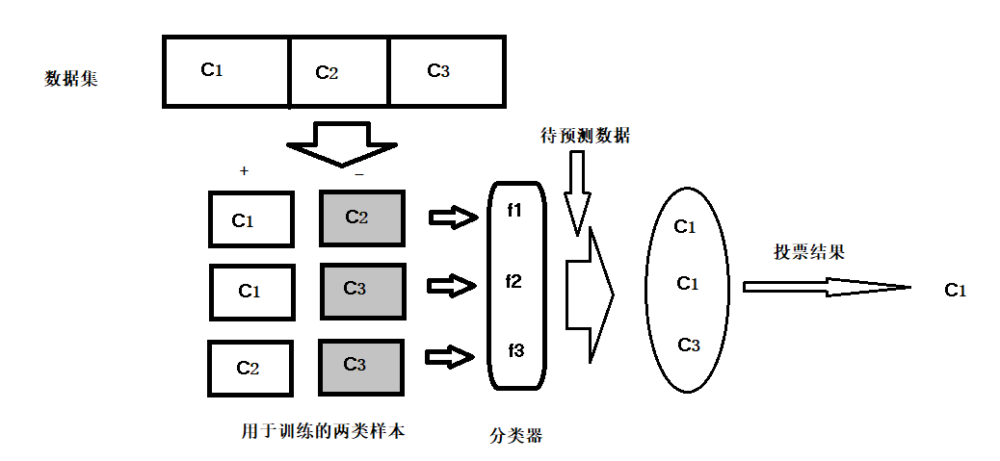

[TOC]


------

# 线性模型

给定一系列样本$x^{(j)} = (x_{1}^{(j)};x_{2}^{(j)},\dots,x_{n}^{(j)})$,其中$x_{1}^{(j)},x_{2}^{(j)},\dots,x_{n}^{(j)}$为第$j$个样本的$n$个属性值,线性模型尝试学习得到一个通过线性组合来进行预测的函数.即

$$
f(x) = \omega_1 x_1 + \omega_2 x_2 + \dots + \omega_n x_n + b  
$$

用向量表示为

$$
f(x) = \omega^T x + b
$$

其中$\omega = (\omega_1; \omega_2 ; \dots ; \omega_n)$.$\omega 和 b$ 通过学习得到后,模型就得以确定.

## 线性回归(linear regression)

线性回归是最基本的线性模型.给定数据集$D = \{(x^{(j)},y^{(j)}) | 1 \le j \le m\}$.线性模型试图学会

$$
f(x^{(j)}) = \omega x^{(j)} + b \approx y^{(j)}
$$

为了使预测准确,我们可以使和方差(SSE)最小化.

$$
(\omega^*,b^*) = arg min \sum_{j=1}^{m} (f(x^{(j)}) - y^{(j)})^2 \\
= argmin \sum_{j=1}^{m} (\omega x^{(j)} + b - y^{(j)})^2
$$

数学上求解上述表达式可以采用"正规方程法"."正规方程法"利用最小二乘法,试图找到一个超平面,使所有样本到平面的欧氏距离之和最小.

> 超平面:对于n维欧式空间,n-1维线性空间(余维数为1)被认为是一张超平面.

对于含有偏置$b$的回归模型,可以看成拥有$n+1$个属性的无偏置的线性模型.此时X矩阵可以写为

$$
X = 
\begin{pmatrix}
x^{(1)}_1 & x^{(1)}_2 & \dots & x^{(1)}_n & 1 \\ 
x^{(2)}_1 & x^{(2)}_2 & \dots & x^{(n)}_n & 1 \\ 
\vdots & \vdots & \ddots & \vdots & \vdots \\
x^{(m)}_1 & x^{(m)}_2 & \dots & x^{(m)}_n & 1 \\ 
\end{pmatrix}
$$

目标写为矩阵

$$
y = \begin{pmatrix}
y^{(1)} \\ y^{(2)} \\ \vdots \\ y^{(m)}
\end{pmatrix}
$$

设$\hat{\omega} = (\omega , b)$,此时,回归模型可以写成

$$
y = X (\omega,b) = X \hat{\omega}
$$

两边同时左乘$X^T$,得

$$
X^Ty = X^TX\hat{\omega}
$$

两边同时左乘$(X^TX)^{-1}$(伪逆),得

$$
\hat{\omega} = (X^T X)^{-1} X^T y
$$

为最佳近似解.

除了正规方程法求解之外,还可以使用梯度下降的优化方法得到一个较优解.

设$E(\omega,b) = \sum_{j=1}^{m} (\omega x^{(j)} + b - y^{(j)})^2$,我们分别对$\omega和b$求偏导.

$$
\frac{\partial{E}}{\partial \omega} = 2 \bigg(\omega \sum_{j=1}^m {x^{(j)}}^2 - \sum_{j=1}^m(y^{(j)} - b) x^{(j)} \bigg)
\\ 
\frac{\partial E}{\partial b} = 2 \bigg( mb - \sum_{j=1}^m (y^{(j)} - \omega x^{(j)}) \bigg)
$$

令上式均为0即可得到$\omega$的最优解.

> 在实际的梯度下降中,受到各种参数的影响,得到的解可能与最优相差一定的距离.

### 使用 FastModel 线性回归

FastModel 中线性回归库位于 `FastModel.LR`.内部含有继承自`FastModel.Solver.Solver`的线性回归求解器`LSolver`(抽象类).

`FastModel.LR`提供了基于正规方程的线性回归求解器`NE_LSolver`和批梯度下降线性回归求解器`GD_LSolver`.

<center>

</center>

#### 代码解析

**LSolver** : 线性回归求解器

```py
● __init__(self): 初始化

    · R_2 : 拟合优度
    · MSE : 均方误差
    · RMSE : 均方根误差
    · MAE : 平均绝对误差

● fit(self,X,Y) : 拟合

● predict(self,data): 预测

● get_R2(self): 获取拟合优度

● get_MSE(self): 获取均方误差

● get_RMSE(self): 获取均方根误差

●get_MAE(self): 获取平均绝对误差

```

**NE_LSolver** : 正规方程-线性回归求解器

```py
● __init__(self) : 初始化

● fit(self,X,Y) : 拟合

    · X : numpy.array
            自变量值，数组形状(m,n),
            其中m是样本数量，n是自变量空间的维数
    · Y : numpy.array
        因变量值，数组形状(m,1),
        其中m是样本数量

    --返回--
    numpy.array, 返回回归的参数数组
```

**GD_LSolver** : 批梯度下降-线性回归求解器

```py
● __init__(self) : 初始化

    · history : 参数历史
    · train_loss_history : 训练集损失历史
    · validation_loss_history : 验证集损失历史
    · train_mse_history : 训练集mse历史
    · validation_mse_history : 验证集mse历史
    · train_rmse_history : 训练集rmse历史
    · validation_rmse_history :  验证集rmse历史
    · train_mae_history : 训练集mae历史
    · validation_mae_history : 验证集mae历史
    · train_R2_history : 训练集R2历史
    · validation_R2_history : 验证集R2历史

● fit(self,X,Y,epochs,batch_size,optimizer,test_size=0.2,metrics=[],shuffle=False,iterations=1,epsilon=1e-8): 拟合

    · X : numpy.array
            自变量值，数组形状(m,n),
            其中m是样本数量，n是自变量空间的维数
    · Y : numpy.array
        因变量值，数组形状(m,1),
        其中m是样本数量
    · epochs : 迭代次数
    · batch_size : 每批数据量
    · optimizer : Optimizer,参数优化器
    · test_size : 测试集比例,
                默认 0.2.
    · shuffle : 是否打乱,
                默认 False.
    · iterations : 保留参数,梯度下降函数内部迭代次数,即每批数据进行梯度下降优化的次数
                默认 1.
    · epsilon : 误差,
                默认 1e-8    


    --返回--
    numpy.array,返回回归的参数数组

● predict(self,data) : 预测

    · data : numpy.array
            自变量值，形状(m,n),
            其中m是点的数量，n是自变量的维数

    --返回--
    numpy.array,返回预测值，形状是(m,1)

● draw_metrics(self,metrics="loss"): 绘制评价指标曲线

    · metric : 评价指标名称,
            默认"loss".  备选 "mse","rmse","mae","R2".
```

#### 示例代码

**正规方程法**

```py
from FastModel.LR import *
from FastModel.GD import *
import numpy as np
import matplotlib.pyplot as plt
from mpl_toolkits.mplot3d import Axes3D
# =============================================================================
# 线性回归 -- 正规方程法
# =============================================================================
# 测试函数
f = lambda x,y : 3*x+2*y-2

func = lambda x: f(x[0],x[1])
#生成回归拟合集

x = np.linspace(-5,5,100)
y = np.linspace(-5,5,100)

x1 = np.random.uniform(-5,5,30)
y1 = np.random.uniform(-5,5,30)
z_noise = f(x1,y1) + np.random.randint(-5,5,size=x1.shape)

# 正规方程-线性回归求解器
X = np.vstack([x1,y1]).T
Y = z_noise.reshape(-1,1)
sol = NE_LSolver()
res = sol.fit(X,Y)
print("拟合的平面是 \n(%f) x + (%f) y + (%f)"%(res[1],res[2],res[0]))
prediction = sol.predict(X)


# 绘制网格 
xx,yy = np.meshgrid(x,y)
zz = f(xx,yy)

plt3d = plt.figure().gca(projection='3d')
plt3d.plot_surface(xx,yy,zz,alpha=0.2)

# 绘制预测点和原始点
ax = plt.gca()
ax.scatter(X[:,0],X[:,1],Y,color='r',alpha=0.8,label="origin")
ax.scatter(X[:,0],X[:,1],prediction,color='g',alpha=0.8,label="predict")

ax.set_xlabel("x")
ax.set_ylabel('y')
ax.set_zlabel('z')

ax.legend()

plt.show()

#拟合的平面是 
#(2.822226) x + (2.002309) y + (-2.885885)
```

效果如下:

<center>

</center>

<center>

</center>

转动图形,可以看到相比原始点(红色),预测的点(绿色)几乎均位于平面上,可以说明拟合成功.

**梯度下降法**

```py
from FastModel.LR import *
from FastModel.GD import *
import numpy as np
import matplotlib.pyplot as plt
from mpl_toolkits.mplot3d import Axes3D

# =============================================================================
# 线性回归 -- 批梯度下降法
# =============================================================================
# 测试函数
f = lambda x,y : 3*x+2*y-2

func = lambda x: f(x[0],x[1])
#生成回归拟合集

x = np.linspace(-5,5,100)
y = np.linspace(-5,5,100)

x1 = np.random.uniform(-5,5,128)
y1 = np.random.uniform(-5,5,128)
z_noise = f(x1,y1) + np.random.randint(-5,5,size=x1.shape)

# 批梯度下降-线性回归求解器
X = np.vstack([x1,y1]).T
Y = z_noise.reshape(-1,1)
## Adam 求解器 (注意初始点形状为3,分别为x,y的系数和常数项)
opt = GD_Adam(np.zeros(3,dtype=float), learning_rate = 0.01, beta1 = 0.9, beta2 = 0.8)
sol = GD_LSolver()
## epochs 次数很高,这是由于每次Adam只迭代一次导致的,也可以尝试增加iterations
res = sol.fit(X, Y, epochs = 100, batch_size = 16, optimizer = opt)
print("拟合的平面是 \n(%f) x + (%f) y + (%f)"%(res[1],res[2],res[0]))
# 绘制损失图像,查看是否收敛
sol.draw_metrics()
prediction = sol.predict(X)

# 绘制网格 
xx,yy = np.meshgrid(x,y)
zz = f(xx,yy)

plt3d = plt.figure().gca(projection='3d')
plt3d.plot_surface(xx,yy,zz,alpha=0.2)

# 绘制预测点和原始点
ax = plt.gca()
ax.scatter(X[:,0],X[:,1],Y,color='r',alpha=0.8,label="origin")
ax.scatter(X[:,0],X[:,1],prediction,color='g',alpha=0.8,label="predict")

ax.set_xlabel("x")
ax.set_ylabel('y')
ax.set_zlabel('z')

ax.legend()

plt.show()

#拟合的平面是 
#(2.975345) x + (1.821544) y + (-2.524316)
```

效果如下:

<center>

</center>

训练的损失函数不断下降,验证损失函数几乎趋近于0(这可能是测试集比较小导致的),根据早停法,可以在epochs=60的时候停止迭代.

<center>

</center>

<center>

</center>

旋转图形,可以看到拟合效果比较好.

> 提示:一般对于小数据集可以使用正规方程法,否则建议使用批梯度下降法.

### 线性回归变种

在真实世界中,自变量和因变量的关系可能并非线性关系,但可以通过一定的处理手段将其化为线性关系.例如$\frac{1}{y} = \omega^Tx+b$ , $ln(y) = \omega^Tx+b$或者$y = \omega_2^Tx^2+\omega_1^Tx+b$.使用换元的思维,可以得到各种线性回归的变种(称为广义线性模型),例如逻辑回归,Softmax回归,多项式回归等.后面将会着重讲解这几种回归.

## 逻辑回归(Logistic Regrssion)

逻辑回归是一种线性回归的变种,通过对数几率函数(Sigmoid的一种)实现对样本二分类归属的回归和预测.

对于一个二分类的任务,不妨将输出限制在$(0,1)$内,如果一个样本归属于第一类,则希望它的输出预测值尽可能贴近0,否则应尽可能贴近1.

对数几率函数便可以满足这样的要求:

$$
y = \frac{1}{1+e^{-z}} \tag{2.1} 
$$

其中$z = \omega^Tx+b$ , 即:

$$
y = \frac{1}{1+e^{-(\omega^Tx+b)}} \tag{2.2}
$$

经过变换得到:

$$
ln \frac{y}{1-y} = \omega^Tx+b \tag{2.3}
$$

若将$y$看作样本$x$作为正例(第一类)的可能性,则$1-y$是其反例(第二类)可能性,两者之比称为"几率"(odds),对几率取对数,就得到了"对数几率"(logodds ,also called logit).

当然我们可以使用普通的线性回归对$ln \frac{y}{1-y} 和 x $进行回归,除此之外还可以使用"极大似然估计"来估计$\omega和b$.

如果将对数几率函数中的$y$视为类后验概率估计$p(y = 1 | x)$,则可以改写为:

$$
ln \frac{p(y = 1 | x)}{y = 0 | x} = \omega^Tx + b \tag{2.4}
$$

显然有:

$$
p(y= 1 | x) = \frac{ 1 }{1 + e^{-(\omega^Tx + b)}} \tag{2.5} 
$$

$$
p(y=0 | x) = 1 - \frac{ 1 }{1 + e^{-(\omega^Tx + b)}}  \tag{2.6}
$$

计算似然函数得:

$$
L(\omega,b) = \prod_{j=1}^mp(y=1|x)^{y^{(j)}}p(y=0|x)^{(1-y^{(j)})} \tag{2.7}
$$

取对数得对数似然函数:

$$
L'(\omega;b) = \sum_{j=1}^m[y^{(j)}log(p(y=1|x)) + (1 - y^{(j)})log(p(y=0|x))] \tag{2.8}
$$

我们只需要将对数似然函数最大化即可估计$\omega 和 b$.

对$L'$取负号,即为二分类的交叉熵损失函数:

$$
L(\omega,b) = -\sum_{j=1}^m\bigg[y^{(j)}log(p(y=1|x)) + (1 - y^{(j)})log(p(y=0|x))\bigg] \tag{2.9}
$$

或者写成常见的形式:

$$
L(\omega,b) = - \sum_{j=1}^m \bigg[ y^{(j)}log(\hat{y^{(j)}}) + (1-y^{(j)}) log(1- \hat{y^{(j)}}) \bigg] \tag{2.10}
$$

使用梯度下降法降低交叉熵损失函数值,从而可以估计出参数$\omega,b$的大小.

### 使用 FastModel 逻辑回归

FastModel中的逻辑回归库位于`FastModel.LCR`.`FastModel.LCR`内含继承自`FastModel.Solver.Solver`的逻辑回归求解器`LCSolver`(抽象类).

`FastModel.LCR`提供了基于正规方程的逻辑回归求解器`NE_LCSolver`和批梯度下降逻辑回归求解器`GD_LCSolver`.

<center>

</center>

#### 代码解析

**LCSolver** : 逻辑回归求解器

```py
● __init__(self): 初始化

    · TP,TN,FP,FN : 真阳性,真阴性,假阳性,假阴性
    · F1 : F1 评价分数
    · ROC_AUC_SCORE : roc_auc 分数

● fit(self,X,Y): 拟合

● predct_possibility(self,data): 预测概率

● predict_classification(self,data): 预测分类
```

**GD_LCSolver** : 批梯度下降-逻辑回归求解器

```py
● __init__(self): 初始化

    · history : 参数历史
    · train_loss_history : 训练集损失历史
    · validation_loss_history : 验证集损失历史
    · train_accuracy_history : 训练集准确率历史
    · validation_accuracy_history : 验证集准确率历史
    · train_precision_history : 训练集精确率历史
    · validation_precision_history :  验证集精确率历史
    · train_recall_history : 训练集召回历史
    · validation_recall_history : 验证集召回历史


● fit(self,X,Y,epochs,batch_size,optimizer,test_size=0.2,metrics=[],shuffle=False,iteraitons=1,epsilon=1e-8): 拟合

    · X : numpy.array
            自变量值，数组形状(m,n),
            其中m是样本数量，n是自变量空间的维数
    · Y : numpy.array 
        因变量值(0-1)，数组形状(m,1),
        其中m是样本数量
    · optimizer : Optimizer,参数优化器
    · test_size : 测试集比例,
                    默认 0.2.
    · metrics : list,评价指标,
                默认 [].
    · shuffle : 是否打乱,
                默认 False.
    · iterations : 保留参数,梯度下降函数内部迭代· 次数,即每批数据进行梯度下降优化的次数
                默认 1.
    · epsilon : 误差,
                默认 1e-8    

    --返回--
    numpy.array,返回拟合的参数数组

● predct_possibility(self,data): 预测,返回概率

    · data : numpy.array
            自变量值，形状(m,n),
            其中m是点的数量，n是自变量的维数

    --返回--
    numpy.array,返回预测的概率,形状(m,1)

● predict_classification(self,data,threshold): 预测,返回类别

    · data : numpy.array
            自变量值，形状(m,n),
            其中m是点的数量，n是自变量的维数

    · threshold : float,阈值,低于阈值为0类,高于为1类,
            默认为 0.5.

    --返回--
    numpy.array,返回预测的类别,形状(m,1)

● draw_metrics(self,metrics="loss"): 绘制评价指标曲线

    · metric : 评价指标名称,
            默认"loss".  备选 "accuracy","precision","recall".
```

#### 示例代码

**梯度下降法**

```py
from FastModel.GD import *
from FastModel.LCR import *
import numpy as np
import pandas as pd
# =============================================================================
# 逻辑回归
# =============================================================================
# 导入数据集 iris.csv
data = pd.read_csv("iris.csv")
X = data.iloc[:,:3]
classes = data.iloc[:,-1]
Y = np.zeros_like(classes)
names = set(classes)
for k,i in enumerate(names):
    Y[classes == i] = k

X = np.array(X)
# 提取两个类用来回归
X = X[(Y == 0) | (Y == 1),:]
Y = Y[(Y == 0) | (Y == 1)]

Y = Y.astype(int).reshape(-1,1)

# 创建Adam优化器
opt = GD_Adam(np.zeros(4,dtype=float), 
              0.01, 0.99, 0.98)

solver = GD_LCSolver()

solver.fit(X,Y,epochs=150,batch_size=32,shuffle=True,test_size=0.2,optimizer=opt,iterations=100,metrics=["accuracy"])

# 绘制准确率变化历史
solver.draw_metrics(metric="accuracy")

res = solver.predict_possibility(X)
print("\n预测的roc_auc_score\n",roc_auc_score(res,Y))

# 绘制混淆矩阵 
solver.draw_confision_matrix()


#预测的roc_auc_score
# 0.9828000000000002
```

此次代码示例中绘制的是准确率函数:

<center>

</center>

可以看到准确率随着迭代次数的增加,不断提升并最终稳定.

绘制混淆矩阵如下:

<center>

</center>

可以看到预测的准确率还是比较高的.

## 多分类学习

现实中的分类问题常常需要进行多分类.考虑$N$个类别$C_1,C_2,\dots,C_N$,多分类学习的基本思路是拆分法,将多分类任务拆分为若干个二分类任务求解.

最经典的拆分策略有三种:"一对一"(One vs. One , OvO),"一对余"(One vs. Rest, OvR)和"多对多"(Many vs. Many , MvM).

**OvO**

给定数据集$D = \{(x^{(1)},y^{(1)}),(x^{(2)},y^{(2)}),\dots,(x^{(m)},y^{(m)})\} , y^{(j)} \in \{ C_1,C_2,\dots,C_N\} $.OvO将这N个类别两两配对,从而产生$N(N-1)/2$个二分类任务.训练完成后,在测试阶段将获得$N(N-1)/2$个分类结果,最终结果按照被预测得最多的类别作为最终分类结果.

<center>

</center>

**OvR**

OvR每次将一个类的样例作为正例,所有其他类的样例作为反例来训练N个分类器,在测试时如果仅有一个分类器预测为正类,则对应的类别标记作为最终的分类结果.若有多个分类器预测为正类,则通常考虑各个分类器的预测置信度,选择置信度最大的类别标记作为分类结果.

<center>

</center>

**MvM**

MvM是每次将若干个类作为正类,若干个其他类作为反类,OvO和OvR都是MvM的特殊情形. MvM正反类构造最常见的技术是"纠错输出码"(Error Correcting Output Codes, ECOC).
"纠错输出码"主要将N个类进行M次划分,每次划分都有正类和反类,从而形成了二分类训练集,这样会生成M个分类器.使用这M个分类器进行预测,得到一个预测组成的编码,将这个编码与每个类别的编码进行比较,返回其中距离最小的类别作为最终预测结果.

以上分类方法都是基于二分类,有没有一种可以直接分类的方法呢?

Softmax回归方法是逻辑回归向多分类的推广.对于$N$个类别数据集$D$,softmax回归用于得到输入的数据属于各个类别的概率.

对于任意一个给定的输入$x^{(j)}$,我们的函数如下:

$$
h_{\theta}(x^{(j)}) = \begin{bmatrix}
p(y^{(j)} = 1 | x^{(j)};\theta) \\
p(y^{(j)} = 2 | x^{(j)};\theta) \\
\vdots \\
p(y^{(j)} = N | x^{(j)};\theta) 
\end{bmatrix}
= \frac{1}{\sum_{i=1}^Ne^{\theta_i^Tx_i^{(j)}}}\begin{bmatrix}
e^{\theta_1^Tx_1^{(j)}} \\
e^{\theta_2^Tx_2^{(j)}} \\
\vdots \\
e^{\theta_N^Tx_N^{(j)}}
\end{bmatrix}
$$

其中$\theta_1,\theta_2,\dots,\theta_k$是模型的参数.$\frac{1}{\sum_{i=1}^Ne^{\theta_i^Tx_i^{(j)}}}$对概率分布进行归一化.

## 多项式回归

前面提到过多项式回归是一种广义线性回归.我们以简单的多项式为例,如$y = x^2 + 2x + 3$,可以令$x_1 = x^2 , x_2 = x ,x_3 = 1$,从而$y = (1,2,1) \odot (x_1,x_2,x_3)$.对于通过该多项式得到的若干样本点$D = \{(x^{(1)},y^{(1)}),(x^{(2)},y^{(2)}),\dots,(x^{(m)},y^{(m)})\}$,对每个样本点进行变换,得到$D' = \{((x_1^{(1)},x_2^{(1)},x_3^{(1)}),y^{(1)}),((x_1^{(2)},x_2^{(2)},x_3^{(2)}),y^{(2)}),\dots,((x_1^{(m)},x_2^{(m)},x_3^{(m)}),y^{(m)})\}$,并令$x^{(j)'} =(x_1^{(j)},x_2^{(j)},x_3^{(j)})$.根据线性回归模型,我们需要得到的模型是:

$$
f(x^{(j)'}) = \omega x^{(j)'} \approx y^{(j)}
$$

> 在实际的线性回归中,常数项b被认为是一个特殊的权重,从而包含到$\omega$中进行运算.

问题直接回到了线性回归模型的求解.利用正规方程法或者梯度下降法都可以进行求解.这里不再赘述.

### 使用FastModel 多项式回归

FastModel 中多项式回归库位于`FastModel.PR`.含有继承自`FastModel.Solver.Solver`的多项式回归求解器`PSolver`(抽象类).`FastModel.PR`提供了一元多项式回归和二元多项式回归,同样也各自包含基于正规方程和基于批梯度下降的求解器`NE_UPSolver NE_BPSolver GD_UPSolver GD_BPSolver`.

#### 代码解析

**PSolver** : 多项式求解器

```py
● __init__(self): 初始化

    · R_2 : 拟合优度
    · MSE : 均方误差
    · RMSE : 均方根误差
    · MAE : 平均绝对误差

● fit(self,X,Y,ratio=0.2,K=1) : 拟合

    · ratio : 验证集比例,默认为 0.2 
    · K : 多项式次数,默认为 1

● predict(self,data): 预测

● get_R2(self): 获取拟合优度

● get_MSE(self): 获取均方误差

● get_RMSE(self): 获取均方根误差

●get_MAE(self): 获取平均绝对误差
```

**NE_UPSolver** : 正规方程-一元多项式求解器

```py
● __init__(self): 初始化

● fit(self,X,Y,ratio=0.2,K=1) : 拟合

    · X : numpy.array
            样本自变量，形状(n,1),
            其中n为样本熟练
    · Y : numpy.array
        样本的因变量值，形状(n,1),
        其中n为样本数量
    · ratio : float, optional
        验证集比例. 默认是 0.2.
    · K : int , optional
        拟合的多项式次数. 默认是 1.

    --返回--
    numpy.array 返回拟合后的参数

● predict(self,data): 预测

    · data : numpy.array
            自变量值，形状(n,1),
            其中n为点的数量

    --返回--
    numpy.array 返回预测后的结果
```

**NE_BPSolver** : 正规方程-二元多项式求解器

```py
● __init__(self): 初始化

● fit(self,X,Y,ratio=0.2,K=1) : 拟合

    · X : numpy.array
            样本自变量，形状(n,2),
            其中n为样本熟练
    · Y : numpy.array
        样本的因变量值，形状(n,1),
        其中n为样本数量
    · ratio : float, optional
        验证集比例. 默认是 0.2.
    · K : int , optional
        拟合的多项式次数. 默认是 1.

● predict(self,data): 预测

    · data : numpy.array
            自变量值，形状(n,1),
            其中n为点的数量

    --返回--
    numpy.array 返回预测后的结果

```

**GD_UPSolver** : 批梯度下降-一元多项式求解器

```py
● __init__(self): 初始化

    · history : 参数历史
    · train_loss_history : 训练集损失历史
    · validation_loss_history : 验证集损失历史
    · train_mse_history : 训练集mse历史
    · validation_mse_history : 验证集mse历史
    · train_rmse_history : 训练集rmse历史
    · validation_rmse_history :  验证集rmse历史
    · train_mae_history : 训练集mae历史
    · validation_mae_history : 验证集mae历史
    · train_R2_history : 训练集R2历史
    · validation_R2_history : 验证集R2历史

● fit(self,X,Y,epochs,batch_size,optimizer,test_size=0.2,metrics=[],shuffle=False,iterations=1,epsilon=1e-8): 拟合

    · X : numpy.array
            自变量值，数组形状(m,1),
            其中m是样本数量，n是自变量空间的维数
    · Y : numpy.array
        因变量值，数组形状(m,1),
        其中m是样本数量
    · epochs : 迭代次数
    · batch_size : 每批数据量
    · optimizer : Optimizer,参数优化器
    · test_size : 测试集比例,
                默认 0.2.
    · shuffle : 是否打乱,
                默认 False.
    · iterations : 保留参数,梯度下降函数内部迭代次数,即每批数据进行梯度下降优化的次数
                默认 1.
    · epsilon : 误差,
                默认 1e-8    


    --返回--
    numpy.array,返回回归的参数数组,参数所对应次数由低到高排列

● predict(self,data) : 预测

    · data : numpy.array
            自变量值，形状(m,1),
            其中m是点的数量，n是自变量的维数

    --返回--
    numpy.array,返回预测值

● draw_metrics(self,metrics="loss"): 绘制评价指标曲线

    · metric : 评价指标名称,
            默认"loss".  备选 "mse","rmse","mae","R2".
```

**GD_BPSolver** : 批梯度下降-二元多项式求解器

```py
● __init__(self): 初始化

    · history : 参数历史
    · train_loss_history : 训练集损失历史
    · validation_loss_history : 验证集损失历史
    · train_mse_history : 训练集mse历史
    · validation_mse_history : 验证集mse历史
    · train_rmse_history : 训练集rmse历史
    · validation_rmse_history :  验证集rmse历史
    · train_mae_history : 训练集mae历史
    · validation_mae_history : 验证集mae历史
    · train_R2_history : 训练集R2历史
    · validation_R2_history : 验证集R2历史

● fit(self,X,Y,epochs,batch_size,optimizer,test_size=0.2,metrics=[],shuffle=False,iterations=1,epsilon=1e-8): 拟合

    · X : numpy.array
            自变量值，数组形状(m,2),
            其中m是样本数量，n是自变量空间的维数
    · Y : numpy.array
        因变量值，数组形状(m,1),
        其中m是样本数量
    · epochs : 迭代次数
    · batch_size : 每批数据量
    · optimizer : Optimizer,参数优化器
    · test_size : 测试集比例,
                默认 0.2.
    · shuffle : 是否打乱,
                默认 False.
    · iterations : 保留参数,梯度下降函数内部迭代次数,即每批数据进行梯度下降优化的次数
                默认 1.
    · epsilon : 误差,
                默认 1e-8    


    --返回--
    numpy.array,返回回归的参数数组

● predict(self,data) : 预测

    · data : numpy.array
            自变量值，形状(m,2),
            其中m是点的数量，n是自变量的维数

    --返回--
    numpy.array
            返回拟合的参数，参数排列按项的次数从小到大排列，
            次数相同的项，按照字典排序的方法(x,y),x小的排在前面，
            例如 x^3 + 2x^2y + 3xy^2 + y^3 + x
            返回的数组看起来是这样的
            [1,2,3,1,0,0,0,1,0,0]

● draw_metrics(self,metrics="loss"): 绘制评价指标曲线

    · metric : 评价指标名称,
            默认"loss".  备选 "mse","rmse","mae","R2".
```

#### 示例代码

```py
import numpy as np
from FastModel.PR import *
from FastModel.GD import *
# =============================================================================
# 正规方程 -- 一元多项式回归 
# =============================================================================
# 函数
f = lambda x: x**4 - x + 2
# 生成随机点
X = np.random.uniform(-10,10,20).reshape(-1,1)
Y_noise = f(X) + np.random.randint(-5,5,20)


Y = f(X).reshape(-1,1)

sol = NE_UPSolver()
res = sol.fit(X,Y_noise,K=4).flatten()
print("拟合结果为 (%f) x^4 + (%f) x^3 + (%f) x^2 + (%f) x + (%f)"%(res[4],res[3],res[2],res[1],res[0]))

# 拟合结果为 (1.000638) x^4 + (0.003392) x^3 + (-0.091051) x^2 + (-1.122233) x + (3.716588)
```

```py
import numpy as np
from FastModel.PR import *
from FastModel.GD import *
# =============================================================================
# 批梯度下降 -- 一元多项式回归 
# =============================================================================
# 函数
f = lambda x: x**4 - x + 2
X = np.random.uniform(-10,10,128).reshape(-1,1)
Y_noise = f(X) + np.random.randint(-5,5,size=(128,1))


Y = f(X).reshape(-1,1)

opt = GD_Adam(np.zeros(5,dtype=float), 0.1, 0.9, 0.8)
sol = GD_UPSolver()
res = sol.fit(X, Y_noise, K=4, epochs=40, batch_size=32, optimizer=opt,iterations=20)
print("拟合结果为 (%f) x^4 + (%f) x^3 + (%f) x^2 + (%f) x + (%f)"%(res[4],res[3],res[2],res[1],res[0]))

sol.draw_metrics()
# 拟合结果为 拟合结果为 (0.998787) x^4 + (0.004825) x^3 + (-0.030692) x^2 + (-1.211144) x + (1.619661)
```

可以看到损失函数逐渐收敛到较小的范围.在使用批梯度下降法时,应注意优化器的迭代次数,迭代次数过大会导致优化器不断陷入各个批数据的局部最优解而产生震荡,迭代次数太小则优化能力较弱,两者都使得损失函数难以收敛.

<center>

</center>

```py
import numpy as np
from FastModel.PR import *
from FastModel.GD import *
# =============================================================================
# 正规方程 -- 二元多项式回归
# =============================================================================
# 函数
f = lambda x:x[0]**2*x[1] + x[0]*x[1] + x[0]**2 + 3
# 生成随机点
X = np.random.uniform(-10,10,size=(100,2))
Y_noise = np.array([[f(i)] for i in X]) + np.random.randint(-5,5,size=(100,1))

Y = np.array([[f(i)] for i in X]).reshape(-1,1)

sol = NE_BPSolver()
res = sol.fit(X,Y,K=3).flatten()
print("拟合结果为 (%f) x^3 + (%f) x^2y + (%f) xy^2 + \
      (%f) y^3 + (%f) x^2 + (%f) xy + (%f) y^2 + (%f) x + \
          (%f) y + (%f)"%(res[9],res[8],res[7],res[6],res[5],res[4],res[3],
          res[2],res[1],res[0]))

# 拟合结果为 (0.000000) x^3 + (1.000000) x^2y + (0.000000) xy^2 + (-0.000000) y^3 + (1.000000) x^2 + (1.000000) xy + (-0.000000) y^2 + (-0.000000) x + (0.000000) y + (3.000000)
```

```py
import numpy as np
from FastModel.PR import *
from FastModel.GD import *

import numpy as np
from FastModel.PR import *
from FastModel.GD import *
# =============================================================================
# 梯度下降 -- 二元多项式回归
# =============================================================================
# 函数
f = lambda x : x[0]**2*x[1] + x[0]*x[1] + x[0]**2 + 3
# 生成随机点
X = np.random.uniform(-10,10,size=(256,2))
Y_noise = np.array([[f(i)] for i in X]) + np.random.randint(-5,5,size=(256,1))

Y = np.array([[f(i)] for i in X]).reshape(-1,1)

opt = GD_Adam(np.zeros(10,dtype=float), 0.1, 0.9, 0.8)
sol = GD_BPSolver()
res = sol.fit(X, Y_noise, K=3, epochs=20, batch_size=64, optimizer=opt,iterations=10)

print("拟合结果为 (%f) x^3 + (%f) x^2y + (%f) xy^2 + \
      (%f) y^3 + (%f) x^2 + (%f) xy + (%f) y^2 + (%f) x + \
          (%f) y + (%f)"%(res[9],res[8],res[7],res[6],res[5],res[4],res[3],
          res[2],res[1],res[0]))

sol.draw_metrics()

# 拟合结果为 (-0.002314) x^3 + (1.002838) x^2y + (-0.000143) xy^2 +       (-0.000971) y^3 + (0.971192) x^2 + (1.023815) xy + (-0.016670) y^2 + (-0.024467) x +           (-0.121701) y + (2.668964)
```

拟合效果如下

<center>

</center>

> - 一元多项式回归时,应当注意最高次的恰当性,如果次数太小则无法正确拟合(这很好理解),次数太大则会导致过拟合,看起来似乎损失函数收敛到更小的值,但是模型学习了很多噪声信息,从而造成泛化能力较差.
> - 理论上二元多项式回归可以用来回归一元多项式,但建议不要这样.首先一元多项式回归使用的参数更少,计算速度和内存占用会更少,其次二元多项式回归在回归一元多项式时准确率也不会更高,甚至由于数据集本身具有的特性而难以回归到目标多项式上.
> - 由于多项式回归是一种广义线性回归,当然也可以使用`FastModel.LR`模块进行回归,但回归时需要注意参数顺序.

## 关于类别不平衡的问题

类别不平衡(class-imbalance)就是指分类任务任务中不同类别的训练样例数目差别很大.以二分类为例,100个样本中,正类有98个,而反类只有2个,那么返回的分类器有可能获得较好的训练精度,但由于比例不平衡,这样的分类器往往没有价值,因为它几乎无法预测出任何反例.

分类器往往假设"训练集是真实样本总体的无偏估计采样",因此不平衡的样本不符合这个假设,因而就无法得到较好的效果.

目前解决数据不平衡的方法有三类:第一类是直接对训练集里含有较多数据的类进行"欠采样"(undersampling);第一类是对含有较少数据的类进行"过采样"(oversampling);第三类是对阈值进行移动(threshold-moving).
